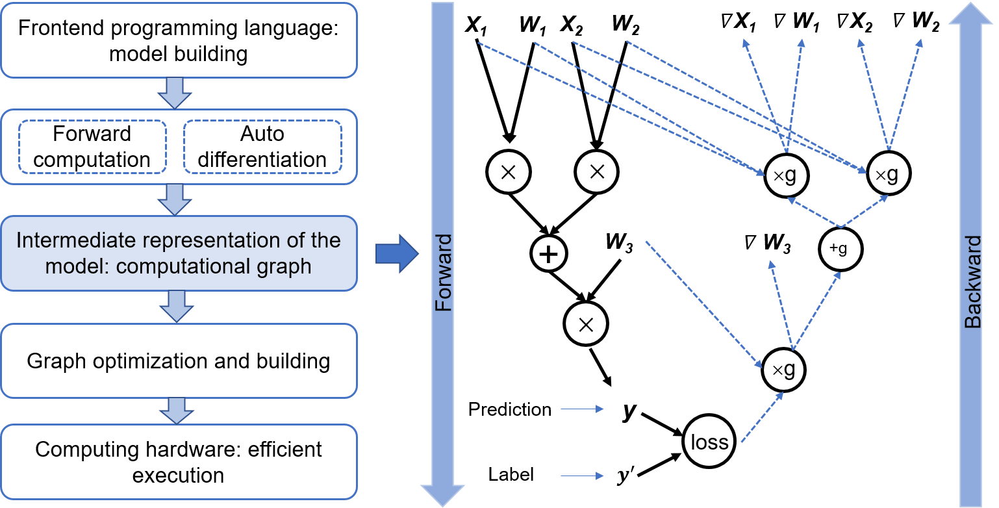

## Computational Graph Functions

:width:`800px`
:label:`dag`

Early machine learning frameworks are mainly designed for fully connected networks and convolutional neural networks (CNNs). Such neural networks have serial layers, whose topology structures can be represented in simple configuration files (e.g., Caffe model definition in Protocol Buffers format).

Early machine learning frameworks are mainly designed for fully connected networks and convolutional neural networks (CNNs). Such neural networks have serial layers, whose topology structures can be represented in simple configuration files (e.g., Caffe model definition in Protocol Buffers format).

Conversely, modern machine learning models have ever more complex structures. Prominent examples include mixture-of-experts (MoE), generative adversarial network (GAN), and attention models. To improve the training efficiency with complex model structures (e.g., loops with branching), machine learning frameworks are expected to quickly analyze operator dependencies, gradient computation, and training parameters, to facilitate model optimization, formulate scheduling strategies, and automate gradient computation. As such, machine learning system designers call for a common data structure to understand, represent, and execute machine learning models. To this end, machine learning frameworks introduce the computational graph technology while still decoupling the frontend and backend languages in design, as shown in :numref:`dag`. From a top-level view, computational graph technology provides the following key functions: 

-   **Unified representation of the computation process.**
    Developers tend to write machine learning programs in high-level programming languages (e.g., Python, Julia, and C++). However, because most devices such as hardware accelerators provide only C/C++ APIs, implementations of machine learning systems are largely restricted to C/C++. Computational graph technology makes it possible to run programs written in different high-level languages on common low-level C/C++ system modules. As a unified representation, a computational graph describes a model's input data, computational logic (usually referred to as operators), and execution sequence of operators. 

-   **Automatic gradient computation.**
    The training program receives data samples (or the training dataset), performs forward computation through the network, and then calculates the loss value. Based on the loss value, the machine learning system computes the gradient for each model parameter and then updates the model parameters. The gradient computation method should apply universally and run automatically, regardless of the model topology and loss computation method. Based on the computational graph, the machine learning system can quickly analyze the gradient transfer relations between parameters, thereby achieving automatic gradient computation.

-   **Lifetime analysis of model variables.**
    During model training, many intermediate variables are generated, for example, the activation values in the forward pass and the gradients in the backward pass. Some of the intermediate variables generated in the forward pass are used in conjunction with the gradients for updating model parameters. With a computational graph, the machine learning system can accurately analyze the lifetime of each intermediate variable (i.e., from the time the variable is generated to the time it is destroyed), helping the framework optimize memory management.

-   **Execution optimization.**
	User programs can have different network structures. With computational graph technology, the machine learning framework can analyze the model topology and operator dependencies, and it automatically searches for operator parallel computing strategies to improve the model execution efficiency.