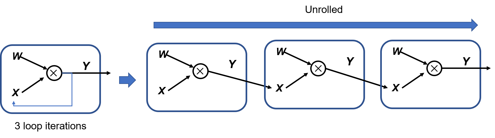

## Computational Graph Basics

A computational graph contains operators (as units of operations) and tensors (as units of data). The operator nodes in a graph are connected with directed edges, which indicate the state of each tensor and dependencies between operators.  :numref:`simpledag`shows a computational graph example of $\boldsymbol{Z}=ReLU(\boldsymbol{X}\times\boldsymbol{Y})$.


:width:`300px`
:label:`simpledag`
### Tensors and Operators

In mathematics, tensors are a generalization of scalars and vectors. Machine learning defines multidimensional data as tensors. The rank of a tensor refers to the number of axes (or dimensions) the tensor has. A scalar is a rank-0 tensor containing a single value, without axes; a vector is a rank-1 tensor with one axis; and a three-channel RGB color image is a rank-3 tensor with three axes. See :numref:`tensor`.


:width:`800px`
:label:`tensor`

In a machine learning framework, a tensor stores not only data itself but also attributes such as the data type, data shape, rank, and gradient transfer status.  :numref:`tensor_attr`describes the main attributes of a tensor.

:Tensor attributes

| Tensor Attribute        | Description   | 
| -------------- | -------|
| shape     | Length of each dimension, for example, [3,3,3].                            |
| dim    | Number of axes (or dimensions). The value is 0 for a scalar and 1 for a vector.                 |
| dtype  | Data type, such as bool, uint8, int16, float32, and float64.   |
| device | Target device, such as a CPU or GPU.                 |
| name       | Tensor name.                                            |
:label:`tensor_attr`

In the following, we explore each tensor attribute with image data as an example. Assume that our machine learning framework loads a 96-pixel by 96-pixel RGB (3-channel) image and converts the image data into a tensor for storage. A *rank*-3 tensor of *shape* [96,96,3] is generated, with the three dimensions representing the image height, image width, and number of channels, respectively. The pixels in the RGB image are represented by unsigned integers ranging from 0 to 255. Therefore, the *dtype* of the resulting tensor is uint8. The image data is normalized before it is fed into a CNN for training. Specifically, its data type is reformatted to float32 so that it is compatible with the default data type of common machine learning frameworks.

Before training, the machine learning framework determines the compute device (i.e., CPU, GPU, or other hardware) and stores the data and weight parameters necessary for training in the memory of the corresponding hardware --- as specified by the *device* attribute. Typically, the device attribute of a tensor is automatically assigned by the machine learning framework based on the hardware environment. Tensors are either mutable or immutable. Mutable tensors store weight parameters and are updated based on gradient information, for example, convolution kernel tensors that participate in convolution operations. Immutable tensors store initial user data or data input to models, for example, the image data tensor mentioned above.

What does a tensor look like in machine learning settings? Most tensors, like image data and convolution kernel tensors, are "rectangular" or "cubic" in shape. That is, such a tensor has the same number of elements along each of its axes. However, there are specialized tensors that have different shapes: ragged and sparse tensors. As shown in Figure :numref:`tensorclass`, a tensor is ragged if it has variable numbers of elements along some axes. Ragged tensors enable efficient storage and processing of irregularly shaped data, such as variable-length texts in natural language processing (NLP) applications. Sparse tensors often handle graph data of graph neural networks (GNNs) and are encoded using special formats such as the coordinate list (COO) to improve storage efficiency.


:width:`800px`
:label:`tensorclass`

Operators are the basic compute units of neural networks. They process tensor data and implement common computational logic in machine learning, including data transformation, conditional control, mathematical calculation, etc. Based on their functionalities, operators are classified into tensor operators, neural network operators, data flow operators, and control flow operators.

-   **Tensor operators** involve tensor structure and mathematical operations. Typical tensor structure operations include reshaping tensors, permuting tensor dimensions, concatenating tensors, etc. For example, we may need to change the dimension order (between "channels first" and "channels last") of image data tensors in CNN applications. Mathematical operations are tensor-based and include matrix multiplication, norm calculation, determinant calculation, eigenvalue calculation, etc. They are often seen in the gradient computation of machine learning models.

-   **Neural network operators**, the foundation of neural network models, are the most common operators, including feature extraction, activation functions, loss functions, optimization algorithms, etc. Feature extraction refers to extracting feature tensors from input data in CNN tasks. With the nonlinear ability introduced by activation functions, neural networks can model highly complex relationships and patterns in data. Optimization algorithms are used to update model parameters so that the loss function is minimized.

-   **Data flow operators**cover data preprocessing and loading. Data preprocessing mainly refers to data resizing, padding, normalization, and argumentation of mostly visual and textual data, whereas data loading involves operations such as shuffling, batching, and pre-fetching of the dataset. Data flow operators transform raw input data into a format meaningful to the machine learning framework and efficiently load the data to the network for training or inference according to the defined number of iterations, reducing memory usage and wait time.

-   **Control flow operators**, usually found in flexible and complex models, are used to control data flows in computational graphs. Typical control flow operators are conditional operators and loop operators. They are provided by either the machine learning framework or the frontend language. Control flow operations affect data flows in both forward and backward computation of neural networks.

### Computational Dependencies

In a computational graph, the dependencies between operators influence the execution sequence and parallelism of operators. The computational graphs involved in machine learning algorithms are directed acyclic graphs, where data flows must not lead to circular dependencies. With a circular dependency, the training program will run into an infinite loop and never terminate by itself. Data stuck in an infinite loop tends to either infinity or 0, yielding invalid results. To analyze the execution sequence and facilitate model topology design, the following describes the dependencies between the compute nodes in a computational graph.

As shown in Figure :numref:`dependence`, if the Matmul1 operator is removed from the graph, there will be no input to the downstream activation function, and the data flow will be interrupted. We can therefore conclude that the operators in this computational graph depend on each other with transitive relations.


:width:`400px`
:label:`dependence`

Three types of dependencies are available.

-   **Direct dependency**: For example, the ReLU1 node is directly dependent on the Matmul1 node. That is, ReLU1 can run properly only when it receives a direct output from Matmul1.

-   **Indirect dependency**: For example, the Add node indirectly depends on the Matmul1 node. Specifically, Matmul1's output is processed by one or more intermediate nodes and then transmitted to the Add node. The Add node directly or indirectly depends on the intermediate nodes.

-   **Mutual independence**: For example, the graph shows no input/output dependency between Matmul1 and Matmul2, meaning that the two nodes are independent of each other.

In the computational graph shown in Figure :numref:`recurrent`, the Add node indirectly depends on the Matmul node; conversely, the Matmul node directly depends on the Add node. The two nodes are stuck waiting for each other's output to start their computation. When input data is manually assigned to the two nodes at the same time, they will compute endlessly, and the training process can never terminate by itself. A circular dependency produces a positive feedback data flow, where data values overflow to positive infinity, underflow to negative infinity, or tend to 0. These all lead to unexpected training results. As such, we should avoid circular dependencies between operators when designing deep learning models.


:width:`300px`
:label:`recurrent`

In machine learning frameworks, the *unrolling* method is used to represent loop iterations. Figure :numref:`unroll` shows a computational graph involving three loop iterations. The subgraph of the loop body is replicated to three (according to the number of iterations) to produce an unrolled loop, where the resulting subgraphs are concatenated in the iteration sequence. The subgraph of one iteration has a direct dependency on that of the previous iteration. In one computational graph, tensors and operators are uniquely identified across the loop iterations, even for the same operation. Unlike circular dependencies, loop iterations do not involve mutual dependencies between operators with unique identifiers. When a subgraph is replicated to produce an unrolled loop, the replicated tensors and operators are assigned new identifiers to avoid circular dependencies.



:width:`800px`
:label:`unroll`

### Control Flows

A control flow maintains the sequence of computation tasks, thereby facilitating the design of flexible and complex models. By introducing a control flow to a model, we can execute a node iteratively any number of times or skip a node based on specific conditions. Many deep learning models rely on control flows for training and inference. For example, models built on recurrent neural networks (RNNs) and reinforcement learning rely on recurrence relations and input status conditions to complete the computation.

Popular machine learning frameworks provide two major types of control flows:

-   **Frontend control flows**: Python control flow statements are used to implement control decision-making in a computational graph. Frontend control flows are easy to use in model building. However, because the computation process of the machine learning framework runs on the backend hardware and the control flow is decoupled from the data flow, the computational graph cannot run entirely on the backend hardware. As such, control flow implementations using the frontend language are referred to as the *out-of-graph approach*.

-   **Framework control primitives**: Machine learning frameworks come with built-in low-level fine-grained control primitive operators. Such operators are executable on compute hardware. When they are introduced to a model, the computational graph can run entirely on the backend hardware. This type of control flow implementations are referred to as the *in-graph approach*.

To explain why we need these different approaches to implement control flows, let's look at the differences between the two approaches.

The out-of-graph approach is familiar to Python programmers. This flexible, intuitive approach allows direct use of Python commands such as `if-else`, `while`, and `for` in building control flows.

The in-graph approach, by contrast, is more complicated. TensorFlow provides a range of in-graph control flow operators (such as `tf.cond` for conditional control, `tf.while_loop`for loop control, and `tf.case` for branch control). These operators are composites of lower-level primitive operators. The control flow representations adopted by the in-graph approach are in a different style from common programming --- this improves computing performance but comes at the expense of usability.

The out-of-graph approach is easier to use. However, not all backend compute hardware is compatible with the frontend runtime environment, and extra efforts may be needed to execute the frontend control flows. Nevertheless, control flows implemented using the in-graph approach are directly executable on hardware independent of the frontend environment, improving efficiency throughout the model building, optimization, and execution process.

The two approaches serve different application scenarios. To run tasks such as model training, inference, and deployment on compute hardware independent of the frontend environment, the in-graph approach is recommended for building control flows. For model validation purposes, the out-of-graph approach allows for higher efficiency in generating model code from the model algorithm.

Major machine learning frameworks support both the out-of-graph and in-graph approaches. In the following illustrations about the impact of control flows on forward and backward computation, we adopt the out-of-graph approach for control flow implementations, given that frontend control flows are more popular in practice. The most common control flows include conditional branches and loops. For a model containing control flow operations, the control flow is replicated to the gradient computational graph during backpropagation, so that the required tensor gradients can be accurately calculated.

Code shows an example of simple conditional control, where `matmul` indicates the matrix multiplication operator.

```python
def control(A, B, C, conditional = True):
    if conditional:     
        y = matmul(A, B)   
    else:     
        y = matmul(A, C)
    return y
```

 Figure :numref:`if`depicts the forward and backward computational graphs of above code. When running a model containing `if` conditions, the program needs to know which branch of each condition is taken so that it can apply the gradient computation logic to the right branch. In the forward computational graph, tensor $\boldsymbol{C}$ does not participate in computation due to conditional control. Similarly, in the backward computational graph, tensor $\boldsymbol{C}$ is skipped in gradient computation. 


:width:`600px`
:label:`if`


A control loop allows us to execute an operation in a loop zero or multiple times. When the loop is unrolled, each operation is assigned a unique identifier to identify different calls to the same operation. Each iteration directly depends on the result of the previous one. Therefore, one or more lists of tensors need to be maintained in the control loop for storing per-iteration intermediate results used in the forward pass and gradient computation. The following code shows a control loop example. In its unrolled loop, $\boldsymbol{X_i}$ and $\boldsymbol{W_i}$ are the lists of intermediate result tensors to be maintained.
```python
def recurrent_control(X : Tensor, W : Sequence[Tensor], cur_num = 3):
    for i in range(cur_num):    
        X = matmul(X, W[i]) 
    return X
# Unroll the loop to obtain an equivalent representation.
def recurrent_control(X : Tensor, W : Sequence[Tensor]):
    X1 = matmul(X, W)   #Let W = W[0], W1 = W[1], and W2 = W[2]. W2 = W[2]
    X2 = matmul(X1, W1)
    Y = matmul(X2, W2) 
    return Y
```
The forward and backward computational graphs of Code are shown in Figure :numref:`while`. The gradient of the control loop is also a loop, with the same number of iterations as the forward loop. The gradient value output by one iteration serves as the input value for calculating the gradient of the next iteration until the loop ends.


:width:`600px`
:label:`while`

### Gradient Computation Using the Chain Rule

In the loop unrolling example in last Section, when input tensor $\boldsymbol{X}$ is fed into the neural network, the data is propagated forward one layer at a time in the computational graph, and the intermediate variables are calculated and stored until $\boldsymbol{Y}$ is output after multilayer computation. In DNN training, the loss function result is calculated based on the output result of forward propagation and the label value. The model backpropagates the loss function information through the computational graph and updates the training parameters based on computed gradients. Typically, backpropagation works by computing the gradients of the loss function with respect to each parameter. Backpropagation based on other information can also work but is not discussed here.

The chain rule method is used to calculate the gradients with respect to each parameter during backpropagation. In calculus, the chain rule provides a technique for finding the derivatives of composite functions. The derivative of a composite function at a given point is the product of the derivatives of each individual function at the corresponding point. Assume that *f* and *g* are functions mapped from the real number *x*. If $y=g(x)$ and $z=f(y)=f(g(x))$, the derivative of *z* with respect to *x* is


$$\frac{dz}{dx}=\frac{dz}{dy}\frac{dy}{dx}$$
:eqlabel:`ch04-1`


The backpropagation algorithm of neural networks executes the chain rule in the sequence defined by the backward computational graph. Generally, neural networks accept 3D tensor inputs and output 1D vectors. Therefore, we can generalize the gradient computation Equations :eqref:`ch04-1` of composite functions with respect to scalars as follows: Assuming that $\boldsymbol{X}$ is an *m*-dimensional tensor,$\boldsymbol{Y}$ is an *n*-dimensional tensor, $\boldsymbol{z}$ is a 1D vector, $\boldsymbol{Y}=g(\boldsymbol{X})$, and $\boldsymbol{z}=f(\boldsymbol{Y})$, the partial derivative of $\boldsymbol{z}$ with respect to each element of $\boldsymbol{X}$ is


$$\frac{\partial z}{\partial x_i}=\sum_j\frac{\partial z}{\partial y_j}\frac{\partial y_j}{\partial x_i}$$
:eqlabel:`ch04-2`

The equivalent form of Equation :eqref:`ch04-2` is

$$\nabla_{\boldsymbol{X}}\boldsymbol{z} = (\frac{\partial \boldsymbol{Y}}{\partial \boldsymbol{X}})^{\top}\nabla_{\boldsymbol{Y}}\boldsymbol{z}$$
:eqlabel:`ch04-3`


where, $\nabla_{\boldsymbol{X}}\boldsymbol{z}$ represents the gradient matrix of $\boldsymbol{z}$ with respect to $\boldsymbol{X}$.


Figure :numref:`chain` shows the application of the chain rule in neural networks, illustrating both forward and backward passes in a single graph. The neural network performs matrix multiplication twice to obtain the predicted value $\boldsymbol{Y}$, and then performs gradient backpropagation based on the error between the output value and label value to update the weight parameters to minimize the error. The weight parameters to be updated include $\boldsymbol{W}$ and $\boldsymbol{W_1}$.


:width:`600px`
:label:`chain`


The mean square error (MSE) is selected as the loss function in this example. Two important questions arise here: How does the loss function transfer the gradient information to $\boldsymbol{W}$ and $\boldsymbol{W_1}$ using the chain rule method? And why do we need to calculate the gradients of non-parameter data $\boldsymbol{X}$ and $\boldsymbol{X_1}$? To answer these questions, let's analyze the computation details of forward and backward propagation. First, the loss value is calculated through forward propagation in three steps: (1) $\boldsymbol{X_1}=\boldsymbol{XW}$; (2) $\boldsymbol{Y}=\boldsymbol{X_1W_1}$; and (3) Loss=$\frac{1}{2}$($\boldsymbol{Y}$-Label)$^2$.

The loss function is calculated to minimize the distance between the prediction value and the label value. According to the chain rule, backpropagation is performed through Equations :eqref:`ch04-4` and :eqref:`ch04-5` to calculate the gradients of the loss function with respect to parameters $\boldsymbol{W}$ and $\boldsymbol{W_1}$:


$$\frac{\partial {\rm Loss}}{\partial \boldsymbol{W_1}}=\frac{\partial \boldsymbol{Y}}{\partial \boldsymbol{W_1}}\frac{\partial {\rm Loss}}{\partial \boldsymbol{Y}}$$
:eqlabel:`ch04-4`

$$\frac{\partial {\rm Loss}}{\partial \boldsymbol{W}}=\frac{\partial \boldsymbol{X_1}}{\partial \boldsymbol{W}}\frac{\partial {\rm Loss}}{\partial \boldsymbol{Y}}\frac{\partial \boldsymbol{Y}}{\partial \boldsymbol{X_1}}$$
:eqlabel:`ch04-5`

Both Equations :eqref:`ch04-4` and :eqref:`ch04-5` solve $\frac{\partial {\rm Loss}}{\partial \boldsymbol{Y}}$, which corresponds to grad $\boldsymbol{Y}$ in Figure :numref:`chain`. $\frac{\partial {\rm Loss}}{\partial \boldsymbol{Y}}\frac{\partial \boldsymbol{Y}}{\partial \boldsymbol{X_1}}$ in Equation :eqref:`ch04-5` corresponds to grad grad $\boldsymbol{X_1}$ in Figure :numref:`chain`. To calculate the gradient of model parameter $\boldsymbol{W}$, the gradient of intermediate result $\boldsymbol{X_1}$ is calculated. This also answers the second question raised above. The gradients of non-parameter intermediate results are calculated to facilitate gradient computation with regard to each parameter.

Because $\boldsymbol{X_1}=\boldsymbol{XW}$, $\boldsymbol{Y}=\boldsymbol{X_1W_1}$, and Loss=$\frac{1}{2}$($\boldsymbol{Y}$-Label)$^2$, Equations :eqref:`ch04-4` and :eqref:`ch04-5` are expanded to :eqref:`ch04-6` and :eqref:`ch04-7` according to Equations :eqref:`ch04-3`, respectively. Then, we can analyze how variables participate in gradient computation when the machine learning framework uses the chain rule to build a backward computational graph.


$$\frac{\partial {\rm Loss}}{\partial \boldsymbol{W_1}}=\frac{\partial \boldsymbol{Y}}{\partial \boldsymbol{W_1}}\frac{\partial {\rm Loss}}{\partial \boldsymbol{Y}}=\boldsymbol{X_1}^\top(\boldsymbol{Y}-{\rm Label})$$
:eqlabel:`ch04-6`

$$\frac{\partial {\rm Loss}}{\partial \boldsymbol{W}}=\frac{\partial \boldsymbol{X_1}}{\partial \boldsymbol{W}}\frac{\partial {\rm Loss}}{\partial \boldsymbol{Y}}\frac{\partial \boldsymbol{Y}}{\partial \boldsymbol{X_1}}=\boldsymbol{X}^\top(\boldsymbol{Y}-{\rm Label})\boldsymbol{W_1}^\top$$
:eqlabel:`ch04-7`


Equation :eqref:`ch04-6` uses intermediate result $\boldsymbol{X_1}$ in the forward computational graph when calculating the gradient of $\boldsymbol{W_1}$. In equation :eqref:`ch04-7`, both input $\boldsymbol{X}$ and parameter $\boldsymbol{W_1}$ are used for calculating the gradient of parameter $\boldsymbol{W}$. This answers the first question. The gradient information transferred backward from downstream network layers, and the intermediate results and parameter values in forward computation, all have roles to play in calculating the gradient of each parameter in the graph.


Based on Figure :numref:`chain` and Equations :eqref:`ch04-4`, :eqref:`ch04-5`, :eqref:`ch04-6` and :eqref:`ch04-7`, when the chain rule is used to construct a backward computational graph, the computation process is analyzed and the intermediate results and gradient transfer status in the model are stored. The machine learning framework improves the backpropagation efficiency by reusing buffered computation results.


We can generalize the chain rule to wider applications. With flexible control flows, the machine learning framework can quickly analyze the computation processes of the forward data flow and backward gradient flow by using computational graph technology, effectively manage the lifetime of each intermediate result in memory, and improve the overall computation efficiency.
