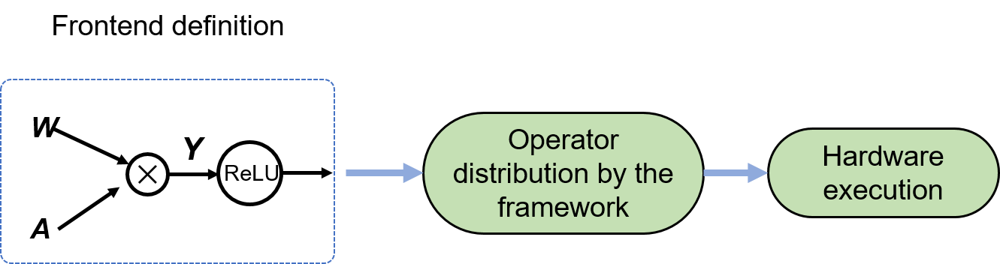

## Generating a Computational Graph
In the previous section, we explored the ingredients of a computational graph. Now let's proceed to the next question --- how is a computational graph automatically generated? Machine learning frameworks support two approaches to implementing computational graphs: static and dynamic. The static approach builds a static (unchanging) graph based on information such as the network topology and parameter variables described by the frontend language. Because frontend languages are independent, static graphs are especially suitable for model deployment (e.g., deploying a facial recognition application on mobile devices).

Unlike the static approach, the dynamic approach dynamically generates a temporary graph based on the frontend description each time the model is executed. Dynamic graphs are easy to debug, making it possible to fine-tune models efficiently on the fly. Major machine learning frameworks such as TensorFlow and MindSpore are compatible with both approaches. And although PyTorch uses dynamic graphs, it also offers dynamic-to-static conversion support for efficient model execution. To choose the right approach for a specific task, we need to consider the task requirements as well as the pros and cons of each approach.

### Static Graph

The static graph approach decouples the definition and execution processes. That is, a static graph is compiled before it is executed, as shown in Figure  :numref:`static`.


:width:`800px`
:label:`static`


When a model program is generated using the frontend language, the machine learning framework first analyzes the model topology for information such as the connections between network layers, parameter variable settings, and loss functions. The framework then compiles the model description into fixed code (i.e., a static computational graph) that can be invoked and executed by the computing backend. In this case, subsequent training or inference on this model is no longer frontend-dependent. Specifically, when input data is fed into the static graph, the operators in the graph are directly scheduled to hardware for execution. And to improve hardware computational efficiency, we can also convert a static graph into other equivalent structures through various optimization strategies.

The following code shows an example of generating and executing a simple static graph. In the frontend definition phase, some machine learning frameworks require developers to declare predefined configuration items including tensor placeholders, loss functions, optimization functions, network building and runtime environments, and network executors, as well as in-graph control statements using control flow operators. The design of machine learning frameworks has recently been improved to provide easy-to-use APIs and a unified model building paradigm. For example, MindSpore enables unified frontend programming representations featuring dynamic and static integration. To illustrate, let's consider the following simple model.

```python
def model(X, flag):
    if flag>0:     
        Y = matmul(W1, X)   
    else:     
        Y = matmul(W2, X)
    Y = Y + b
    Y = relu(Y)
    return Y
```


The machine learning framework does not load input data when generating a static graph. Instead, *placeholder* tensors are used to hold places of input data. In the static graph defined the above code, we need to create a placeholder for input $\boldsymbol{X}$ in line 1. Because no actual input is fed into the model during static graph generation, the control flow defined in line 2 cannot make control decisions at build time. As such, we need to add the control flow operator and the computational subgraph of each branch to the static graph. When the model receives actual inputs during runtime, different branches are taken (by running the corresponding computational subgraphs) depending on different inputs. However, not all machine learning frameworks are able to compile Python control flows as their static graph equivalents. In order to implement control flows in this case, we can use the control primitives provided by the framework.


:width:`800px`
:label:`staticgen`


Static computational graphs offer two distinct advantages. First, they yield better performance with less memory. When building a static graph, the machine learning framework acquires the complete model topology containing global information of the model, which facilitates the formulation of graph optimization strategies (e.g., the operator fusion strategy that fuses two or more operators into a larger one). As shown in Figure :numref:`staticgen`, the Add and ReLU operators are fused into one operator to reduce the loads/stores of intermediate results and low-level scheduling overhead, thereby improving the execution performance and efficiency with a lower memory footprint. Static graphs allow for many optimization strategies at build time, which we will discuss in later sections.

Second, by converting static graphs into executable code within the machine learning framework, we can directly deploy our models on various hardware platforms to provide efficient inference services. Also, we can store static graphs using serialization techniques for future execution (either model training or inference), eliminating the need to rebuild the frontend source code from scratch every time before execution.

Once the frontend code of the model is compiled into a static graph, the graph structure is fixed. If we introduce any optimizations to the graph, the optimized code can differ significantly from the original. However, the optimized code is not intuitively visible, meaning that it is sometimes impossible to locate a runtime error based on the returned code line number in the optimized code. Consider a simple case. Assuming that the Add and ReLU operators in the above code have been fused for optimization, if a runtime error related to the fused operator is reported, it would be hard for us to determine the exact error location (Add or ReLU).

In addition, in the daunting process of model debugging and testing, intermediate results cannot be printed in real time. To make this happen, we need to insert additional code to the source code and then recompile the source code for execution, making debugging less efficient. By contrast, the dynamic graph approach offers more flexibility.


### Dynamic Graph

Figure :numref:`dynamic`shows the principle of the dynamic graph approach. A dynamic graph is defined as it runs. The frontend interpreter parses the graph code and the machine learning framework distributes the operators in the graph to the backend for just-in-time (JIT) execution. Adopting the user-friendly imperative programming paradigm, the dynamic graph approach allows developers to create neural network models at the frontend and is therefore favored by a vast number of deep learning researchers.


:width:`600px`
:label:`dynamic`

Next, we reuse the pseudocode in the previous section to compare the dynamic and static graph approaches.

While these two approaches differ only slightly in their frontend representations, they differ dramatically in terms of their compilation and execution mechanisms. Unlike the static graph approach, the dynamic graph approach calls the built-in operator distribution function of the machine learning framework through the Python API to distribute Python operators to the hardware backend (e.g., CPU, GPU, or NPU) for accelerated computing, which then returns the computational result to the frontend. This process does not generate a static computational graph. Instead, the framework describes the model topology using the frontend language, schedules and executes the model based on computational dependencies, and dynamically generates a temporary graph.


Figure :numref:`dynamicgen`shows the process of generating a dynamic graph.


:width:`700px`
:label:`dynamicgen`

Forward computation is run through the neural network in the sequence defined by the model declaration. Once the model receives input $\boldsymbol{X}$, the machine learning framework starts to generate a dynamic graph by adding the input node to the graph and sending the data to the downstream node. The control flow (if available) makes a data flow decision immediately. For example, in Figure :numref:`dynamicgen`, if the conditional returns true, only the Matmul operator node with respect to tensor $\boldsymbol{W1}$ is added to the graph. Then, the machine learning framework inserts the Add and ReLU operator nodes based on the operator sequence and computational dependencies defined in the code. For each newly added operator node, the machine learning framework distributes and executes the operator, returns the computational result, and prepares to pass the result to the next node. When forward computation resumes, the last dynamic graph becomes invalid and a new dynamic graph is created according to current input and control decision. In contrast with a static graph that represents the entire model described in the frontend language, a dynamic graph is generated on the fly as the control flow and data flow evolve over time. For this reason, the machine learning framework has few opportunities to optimize the model in the dynamic graph setting.

In the static graph setting, as the model definition is entirely available, a complete forward computational graph and a complete backward computational graph can be constructed simultaneously. However, in the dynamic graph setting, gradients are calculated for backpropagation as the forward pass proceeds. Specifically, the machine learning framework collects information of each backward operator and tensor participating in gradient computation based on the information of each operator called in the forward pass. Once the forward pass ends, the operator and tensor information for backpropagation becomes available. With this information, the machine learning framework creates a backward computational graph and runs it on hardware to complete gradient computation and parameter update.


As shown in Figure :numref:`dynamicgen`，when the Matmul operator with respect to tensor $\boldsymbol{W1}$ is called, the framework runs the Matmul operator to calculate the product of inputs $\boldsymbol{X}$ and $\boldsymbol{W1}$, and then records the operator and tensor $\boldsymbol{X}$ that will participate in backpropagation based on the backward computation process Grad\_$\boldsymbol{W1}$=Grad\_$\boldsymbol{Y}*\boldsymbol{X}$, thereby completing the forward pass and producing a backward computational graph.

Although the optimization techniques useful in the static graph setting do not work for dynamic graphs (because the complete network structure is unknown until the dynamic graph runs), researchers and developers can easily analyze errors and debug results during model testing and optimization. This is made possible by dynamic graphs supporting JIT computing and returning computational results immediately with the execution of each statement.

Also, the dynamic graph approach enables flexible execution using native control flows provided by the frontend --- unlike static graphs, which involve complex control flows along with programming and debugging difficulties. Consequently, the dynamic graph approach lowers the barriers to programming for beginners while also improving the iteration efficiency of algorithm development and model optimization.

### Dynamic Graph vs. Static Graph

The two approaches for implementing computational graphs have their pros and cons, as described in Table :numref:`cmp_dynamic_static`。

:Static graph vs. dynamic graph

| Feature| Static Graph   | Dynamic Graph    |
| --- | ------- | ------- |
| On-the-fly intermediate results| No                 | Yes                 |
| Code debugging    | Difficult                  | Easy                 |
| Control flow implementation  | Specialized syntax          | Frontend syntax        |
| Performance           | Better, supporting wide optimization strategies | Poor, supporting limited graph optimizations |
| Memory footprint       | Low           | High     |
| Direct deployment       | Yes           | No        |
:label:`cmp_dynamic_static`


Compared with the dynamic graph approach, the static graph approach seems to be less user-friendly to developers because intermediate results are not available on the fly, code debugging is difficult, and implementing control flows is complex. However, static graphs ensure higher execution performance than dynamic graphs. See the example in following Code.

```python
def model(X1, X2):
    Y1 = matmul(X1, W1)
    Y2 = matmul(X2, W2)
    Y = Y1 + Y2
    output = relu(Y)
    return output
```
If the static approach is used to implement in the above code, the machine learning framework creates a complete computational graph. Because tensors $\boldsymbol{Y_1}$ and $\boldsymbol{Y_2}$ are computed independently from each other, we can implement automatic parallelism on them in order to improve the computational efficiency. Furthermore, the static approach allows many more optimization strategies to improve efficiency while also lowering memory footprint, for example, fusing operators Add and ReLU to reduce the loads and stores of the intermediate variable $\boldsymbol{Y}$. Conversely, if the dynamic approach is used without a manually configured parallelism strategy, the machine learning framework is unaware of the independence between operators due to the lack of a complete computational graph. Consequently, the framework has to execute the operators, including Add and ReLU, in a defined order and store the intermediate variable $\boldsymbol{Y}$. To further reduce memory footprint, the static approach narrows down the intermediate variables to be stored for backpropagation beforehand in the forward pass, based on the forward and backward computational graphs defined prior to execution. This is not feasible in the dynamic approach, where the backward computational graph is defined only after the forward pass is complete. As such, more intermediate variables have to be stored in the forward pass to ensure the backpropagation efficiency, resulting in higher memory footprint.


To choose one approach over the other, we should consider their pros and cons in addition to analyzing specific task requirements. For academic research purposes or in the model design and debugging phases, the dynamic graph approach is suggested because it allows for quick testing of experimental ideas and iterative update of the model structure. In other cases where the model structure is determinant, to accelerate the training process or deploy a model on specific hardware, using the static graph approach offers higher efficiency.

### Conversion Between and Combination of Dynamic and Static Graphs

Dynamic graphs are easy to debug and suitable for model design and testing, whereas static graphs improve execution efficiency and shorten model training time. Is there a way for the machine learning framework to combine the merits of both approaches? Major machine learning frameworks, such as TensorFlow, MindSpore, PyTorch, and PaddlePaddle, have added support to convert between dynamic and static graphs, allowing developers to program using the dynamic graph approach and letting the framework automatically convert the code to a static equivalent for execution.

Table :numref:`dynamic_static_switch` lists the APIs for dynamic graph to static graph conversion provided by major frameworks.

:Dynamic graph to static graph conversion support of major frameworks

|       Framework          |                 Dynamic Graph to Static Graph Conversion                       |
| :-----------------:| :--------------------------------------------------: |
|        TensorFlow   |`@tf_function`: builds a static graph by tracing operators,，<br>where AutoGraph automatically transforms a control flow to the equivalent static statement. |
|         MindSpore    |   `context.set_context(mode=context.PYNATIVE_MODE)`dynamic graph mode, <br>`context.set_context(mode=context.GRAPH_MODE)` static graph mode, <br>`@ms_function`: builds a static graph from source code.    |
|         PyTorch      |  `torch.jit.script()`: builds a static graph from source code. <br>`torch.jit.trace()`: builds a static graph by tracing operators.  |
|      PaddlePaddle    | `paddle.jit.to_static()`: builds a static graph from source code.<br>`paddle.jit.TracedLayer.trace()`: builds a static graph by tracing operators. |
:label:`dynamic_static_switch`              
                                  

These dynamic-to-static conversion methods fall into the following two categories:

-   **Tracing**: A static graph is built by tracing operator scheduling in a dynamic graph.

-   **Source code transformation**: The frontend code is inspected and built as static graph code. And the static graph executor is automatically called to run the static graph.

The **tracing** method goes through two simple phases. The first is to generate a dynamic graph, following a workflow similar to that shown in Figure :numref:`dynamicgen`. The machine learning framework runs the created dynamic graph and traces the data flow and operator scheduling in the dynamic graph to produce a static graph. Note that the dynamic graph is not destroyed; instead, it is preserved as a static graph for subsequent execution. As the machine learning framework finishes executing the dynamic graph, a static graph is produced. In the second phase when the model is called again, the machine learning framework runs the static graph for computation. The tracing technique only traces the operators scheduled when the dynamic graph is run for the first time. However, if the model has a data-dependent conditional, only one branch of the conditional can be traced --- the traced graph would be unable to take alternate branches. Similarly, the traced graph cannot include every iteration if there is a data-dependent loop.

Unlike dynamic graph code which is parsed and executed by the frontend interpreter, a static graph must be first created by the graph compiler of the machine learning framework before execution. Because the graph compiler cannot directly deal with dynamic graph code, the source code transformation--based method is introduced to convert the dynamic graph code into static code description. 

The **source code transformation**--based method can overcome the drawbacks involved in the tracing method and also consists of two phases, as shown in Figure :numref:`ast`. The first involves lexical and syntax analysis. Specifically, the lexical analyzer scans and analyzes every character in the dynamic graph code, splits the source text by removing any white spaces or comments, and returns a stream of tokens. Then, the syntax analyzer or parser analyzes the token stream, eliminates any errors, and generates a parse tree as the output of the phase. In the second phase, the built-in translators of the machine learning framework scan and translate each part of the abstract syntax tree to map the grammatical structures from dynamic graph format into static graph format. Any control flow written in the frontend language is transformed into the corresponding static graph API in this phase, so as to include every branch of the control flow in the resulting graph. Next, we can easily generate static graph code from the translated syntax tree.


:width:`800px`
:label:`ast`

To improve the computational efficiency, we can transform the entire model graph for fast deployment on hardware. Alternatively, we can consider transforming some of the model functions into static subgraphs and embedding them into the global dynamic graph as individual operators, so that these exact functions would run in the form of static graphs at execution time. This not only improves computational efficiency but also retains flexibility for code debugging.


Code as follow shows a simple model, which can be built into a dynamic graph as a whole. In this example, we transform the `add_and_relu` module into a static subgraph. The model runs on the input data in a predefined sequence, resulting in a temporary dynamic graph. When the `Y=add_and_relu(Y,b)` statement is executed, the machine learning framework automatically runs the static subgraph transformed from the module, achieving a performance gain by combining the advantages of dynamic and static graphs. 


```python
def add_and_relu(Y, b):
    Y = Y + b
    Y = relu(Y)
    return Y

def model(X, flag):
    if flag>0:     
        Y = matmul(W1, X)   
    else:     
        Y = matmul(W2, X)
        Y = add_and_relu(Y, b)
    return Y
```

 Dynamic-to-static conversion is mostly found in the model deployment stage, as a workaround to the hardware constraints on dynamic graph deployment, which requires the frontend model definition code for topology discovery in addition to the file of already-trained parameters. To remove the frontend dependency, once model training in dynamic graph mode is complete, we may convert the model into static graph format and serialize the model and parameter files, thereby expanding the list of supported hardware.