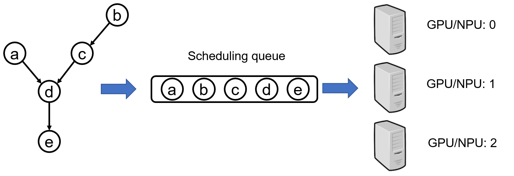
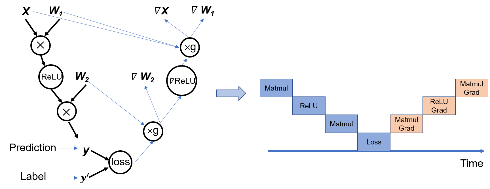
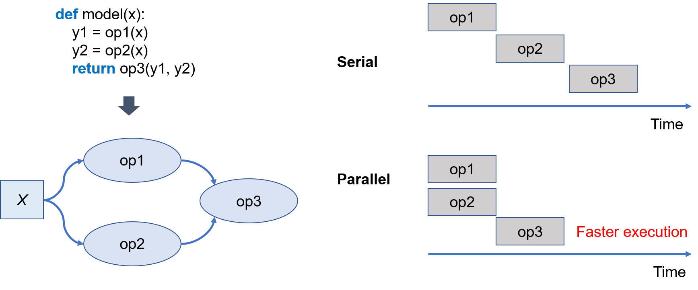
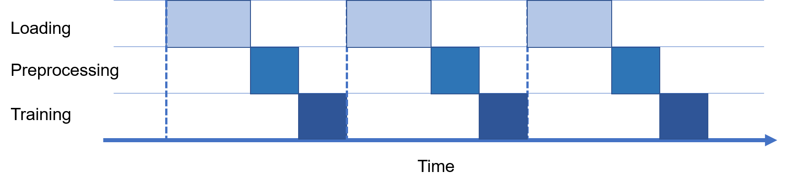
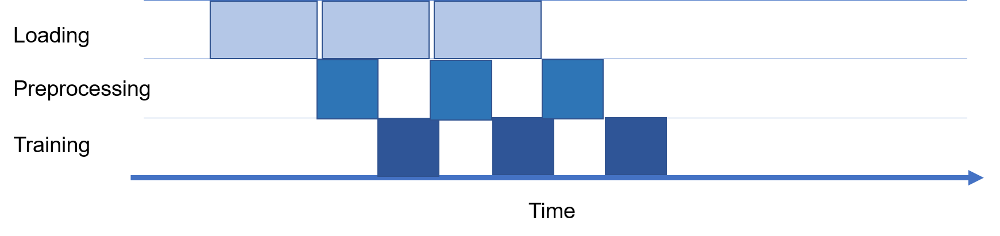
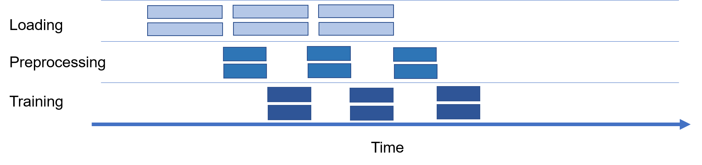

## Scheduling and Executing Computational Tasks

Training a model is conducted by scheduling the execution of the operators in a computational graph. From a broad perspective, a training job runs a computational graph for a defined number of iterations, relying on optimal scheduling of tasks such as data loading and training (inference) execution. Within each iteration, we need to analyze operator-level scheduling based on the graph topology, computational dependencies, and control flows. We optimize the scheduling and execution of computational graphs to make full use of computing resources, improve computational efficiency, and shorten the model training and inference time. The following introduces the typical techniques of computational graph scheduling.

The scheduling execution of the computation graph can be divided into three modes according to the graph generation method, which are operator scheduling, whole graph scheduling, and operator and subgraph combined scheduling. These three modes also correspond to the three modes of dynamic graph, static graph, and combination of dynamic and static in the calculation graph generation mechanism.

Next, we will introduce the scheduling and execution of the calculation graph in detail.

### Operator Scheduling

Operator scheduling means that the operators contained in the algorithm or model are scheduled and executed one by one through the runtime of the Python language. This scheduling mechanism is used when the calculation graph is executed in dynamic graph mode, such as PyTorch's default execution mode and TensorFlow's eager mode.

Operator scheduling includes two steps. In the first step, according to the call sequence of the model operator declaration, the dynamic calculation graph obtains a linear operator scheduling sequence. And the second is distributing the ordering of operators to instruction streams.

In Figure :numref:`schedule`, the directed acyclic graph on the left contains five nodes a, b, c, d, and e and four dependency edges a->d, b->c, c->d, and d->e (e.g., a->d indicates that d depends on a). According to the operator call sequence of the model code, such as a->b->c->d->e, all operator nodes are put into the queue in turn, and the scheduling ends.

:width:`700px`
:label:`schedule`

With the ordering, we then prepare to distribute the operators in the ordering and related data to the GPU hardware for execution. Figure :numref:`single_op_exec` shows the trace of operator scheduling. Once the Python runtime calls an operator, the machine learning framework initializes the operator by determining information such as the operator precision, type and size of each input/output, and target device. It then allocates memory for the operator before copying the memory to the specific device for execution.

:width:`700px`
:label:`single_op_exec`

The operator scheduling method offers high flexibility because operators are directly scheduled by the Python runtime. It facilitates the representation of complex computational logic (such as control flows) and use of Python-native data structures for implementing complex algorithms. Operators are driven by the Python runtime to finish computational tasks, facilitating easy collaboration with Python's large, rich ecosystem.

Despite its advantages, operator scheduling also has some disadvantages. One is that context-based runtime optimizations such as operator fusion and algebraic simplification become difficult. This is because global information about the computational graph is unavailable. Another disadvantage is that computational tasks have to run in serial mode, rather than in parallel, due to the lack of computational topology.

### Graph Scheduling

When the calculation graph uses the static graph mechanism for whole-graph scheduling execution, operators will be sent to the hardware for execution one by one according to a certain execution sequence. However, global information about the computational graph is available. it can analyze operator dependencies and the number of computing devices, and complete the scheduling and execution of the entire graph in the following two ways:

- **Serial**: executes its tasks one at a time, in the order that they are added to the queue.This method expands a computational graph into a sequence of operators, which are then run separately. Operators are executed in a static order using a single thread, thereby requiring fewer resources.
- **Parallel**: executes its tasks concurrently for higher efficiency.This method expands a computational graph based on operator dependencies. Operators are executed in the order defined by their input dependencies, and those without input dependencies are executed concurrently. This method executes operators in a dynamic order (which may vary in each iteration) using multiple threads, thereby consuming more system resources.

Within a computational graph, most operators are dependent on each other directly or indirectly. When scheduling such operators, their sequence must be guaranteed. Figure :numref:`order` shows a computational graph, where a forward pass is run on the input data to produce a predicted value and then the gradient of the loss function is computed for backpropagation. In general, downstream operators run dependently on the output from the upstream. As such, we have to schedule the operators in this computational graph to a serial queue in order to ensure that each operator receives the necessary input.

:width:`800px`
:label:`order`

A computational graph may also contain operators independent of each other, for example, op1 and op2 shown in Figure :numref:`para`. We can have each operator run on different hardware devices to implement parallel computing. Compared with the serial mode, parallel computing decreases execution time by leveraging more computing resources at the same time.

:width:`800px`
:label:`para`

Serial execution and parallel execution have their own advantages and disadvantages, as summarized in Table numref:`comparsion_execution`.

:Comparison between serial execution and parallel execution
|       Execution Method          |                Serial execution                       |  Parallel execution |
| :-----------------:| :--------------------------------------------------: |:--------------------------------------------------: |
|        Execution Order   | Static |  Dynamic |
|         Execution Threads    |   Single thread  |    Multiple threads     |
|         Resource Consumption      |  Low  |   High   |
:label:`comparsion_execution` 

A computing environment contains more than one type of computing device, such as a CPU, GPU, or other. As such, a computational graph consisting of operators that run on more than one type of computing device is referred to as a heterogeneous computational graph. 

The graph contains the following types of operators based on the computing hardware.

- **CPU operators**: They are C++ operators that run on the host CPU. The computing performance of the CPU depends on the extent to which the multi-core capability of the CPU is utilized.
- **GPU operators**: They run on the GPU (e.g., NVIDIA GPU). GPU kernels are delivered to the host GPU one by one for execution. The GPU features ample parallel computing units that offer significant speedup to parallel algorithms. 
- **Python operators**: They run on the host CPU. Unlike CPU operators, Python operators are interpreted and executed by the Python runtime interpreter.

We mentioned earlier that the dynamic graph mechanism relies on the Python interpreter to distribute operators and execute them serially according to the order of operators defined by the model code. This mode usually allows data to be transmitted on different computing devices. Communication bottlenecks may increase the time spent waiting for operators to execute data, reducing the overall execution efficiency of the calculation graph.  Therefore, the first condition for the efficient execution of the calculation graph is to accurately identify the device where the operator is executed, try to avoid the transmission of data between different devices. Independent operators are scheduled on different devices in parallel. The static graph mechanism can get rid of the constraints of the Python interpreter. The calculation graph is sent to the device at one time, which reduces the number of interactions between the host and the computing chip, and improves computing efficiency and performance.

The combination of operators and subgraphs for scheduling execution mode is a combination of the previous two execution modes. Due to the flexibility of the computing graph structure, the efficiency of computing graphs in complex scenarios may not be optimal when executed on the entire computing chip. For example, computing chips can accelerate floating-point operations, while CPUs are good at processing logical judgments. Therefore, the parts with low execution efficiency for computing chips can be separated and handed over to devices with higher execution efficiency such as CPU for processing, which can take into account both performance and flexibility.

There are different levels of parallelism: operator parallelism, model parallelism, and data parallelism. Operator parallelism is not just about executing independent operators in parallel. Where applicable, we can further partition an operator into multiple parallel child operations. Model parallelism refers to partitioning a computational graph among several devices in order to shorten the time taken by each training iteration. And data parallelism involves training the same computational graph on different data, reducing the total number of iterations and improving training efficiency. We will discuss these three parallelism methods in Chapter Distributed Training.

### Synchronous and Asynchronous Data Loading

As previously mentioned, a single training iteration of a computational graph goes through three serial tasks: data loading, data preprocessing, and model training. Each task is dependent on the output of the previous one. To schedule the three types of tasks in iterative graph training, we can use the synchronous and asynchronous mechanisms at the iteration level.

- **Synchronous**: Tasks are executed in order, one after the other. Tasks have to wait for and coordinate between each other.
- **Asynchronous**: When a task is complete, the same task in the next iteration can be executed immediately.

If the synchronous mechanism is adopted to train the computational graph shown in Figure :numref:`synchronization`, in each iteration, a batch of input data is loaded, preprocessed, and then passed to the computational graph for model training and parameter update. Tasks in the next iteration wait until the current iteration is complete. The synchronous mechanism wastes computation and communication resources because the data preprocessing and model training tasks must wait until a batch of data is completely loaded, and because the I/O channel for data loading is idle at model training time.

:width:`800px`
:label:`synchronization`

In the asynchronous setting shown in Figure :numref:`asynchronous`, after loading and passing a batch of input data to the subsequent data preprocessing task, the I/O channel immediately moves on to the next batch without waiting for the current iteration to complete. In contrast with the synchronous mechanism, the idle time between data loading, data preprocessing, and model training in the asynchronous mechanism is notably reduced, thereby shortening the overall training time with improved execution efficiency.

:width:`800px`
:label:`asynchronous`

To further shorten the training time and improve the execution efficiency, we can combine the asynchronous mechanism with parallel computing, as shown in Figure :numref:`asyn_para`. On the one hand, the asynchronous mechanism reduces the model's wait time for data loading and preprocessing, allowing the model to quickly traverse the entire dataset. On the other hand, parallel computing increases the batch size in iterative training, increasing the efficiency of computing resources.

:width:`800px`
:label:`asyn_para`
