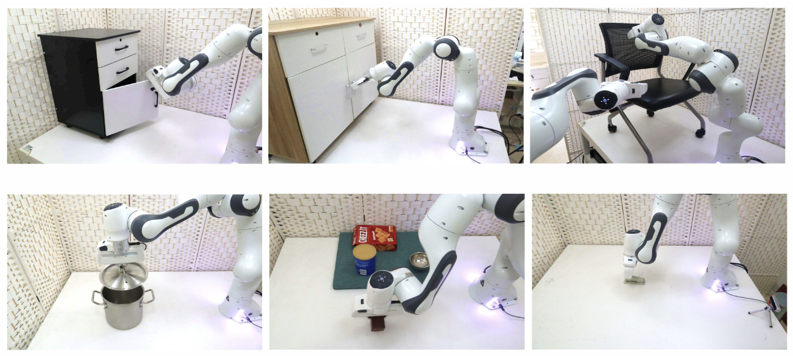
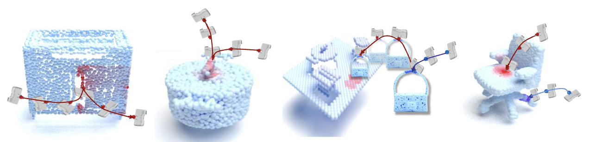

# Modern Robot Learning

## Overview

We human can interact with objects with various shapes, sizes, materials and physics properties. And we have a fantastic ability to do it under different environment settings: we can avoid potentially dangerous collisions, we can finish a task with a long horizon; and we can learn extremely hard task after practice. However, it still a challenge to teach a machine to have above ability. A key challenge in intelligent robotics is creating robots that are capable of directly interacting with the world around them to achieve their goals. The last decade has seen substantial growth in research on the problem of robot manipulation, which aims to exploit the increasing availability of affordable robot arms and grippers to create robots capable of directly interacting with the world to achieve their goals. Learning will be central to such autonomous systems, as the real world contains too much variation for a robot to expect to have an accurate model of its environment, the objects in it, or the skills required to manipulate them.

## Robot Interaction Environments

In the realm of robot learning, the process of acquiring the ability to manipulate objects in real-world settings can be a time-consuming and resource-intensive endeavor. Not only does it demand considerable effort, but it also necessitates substantial hardware investments. To tackle these challenges and expedite the learning process, researchers have turned to data-driven methods that make use of simulation environments. By simulating various scenarios, these environments enable robots to learn and make informed decisions without the need for physically interacting with the real world. In this chapter, we will explore the concept of using simulation environments for robot decision making, highlighting some simulator examples and their key features, while drawing comparisons to the real world and the underlying hardware considerations.

### Learning in Simulation Environments:

Simulators have emerged as indispensable tools for training robots in a controlled and efficient manner. Instead of relying solely on real-world experiences, simulation environments provide a cost-effective means of generating large amounts of training data. This approach not only saves time but also minimizes the risks associated with operating physical robots in potentially hazardous or expensive settings. Furthermore, simulators offer the flexibility to create diverse scenarios and manipulate various environmental parameters, allowing researchers to thoroughly explore different learning strategies and optimize robot decision-making algorithms.

#### Physics Simulation Libraries and Environments

| Year | Simulator | Description |
|------|-----------|-------------|
| 2012 | MuJoCo | MuJoCo offers a unique combination of speed, accuracy and modeling power, designed from the ground up for model-based optimization and optimization through contacts. |
| 2016 | PyBullet | PyBullet is an easy to use Python module for physics simulation, robotics and deep reinforcement learning based on the Bullet Physics SDK. |
| 2016 | Unreal CV | Unreal CV provides functions for perception, navigation, physical simulations, and learning and evaluation of algorithms. |
| 2016 | DeepMind Lab | DeepMind Lab is a first-person 3D game platform designed for research and development of general artificial intelligence and machine learning systems. |
| 2016 | Habitat | Habitat-Sim is a flexible, high-performance 3D simulator with configurable agents, sensors, and generic 3D dataset handling. |
| 2017 | AI2-THOR | AI2-THOR consists of near photo-realistic 3D indoor scenes, enabling research in various domains including deep reinforcement learning and visual question answering. |
| 2018 | CHALET | CHALET includes rooms and house configurations for training and evaluating autonomous agents in a challenging dynamic environment. |
| 2018 | VirtualHome | VirtualHome simulator allows the creation of a large activity video dataset with rich ground-truth, enabling training and testing of video understanding models. |
| 2019 | VRKitchen | VRKitchen enables embodied agents to perform complex tasks involving fine-grained object manipulations in a realistic environment, and supports learning from demonstration. |
| 2020 | SAPIEN | SAPIEN is a realistic and physics-rich simulated environment that hosts a large-scale set of articulated objects, enabling various robotic vision and interaction tasks. |
| 2020 | ThreeDWorld | ThreeDWorld is a platform for interactive multi-modal physical simulation, supporting real-time near-photo-realistic image rendering, high-fidelity audio rendering, and more. |
| 2021 | Brax | Brax is an open-source library for rigid body simulation with a focus on performance and parallelism on accelerators, written in JAX. |
| 2021 | iGibson2.0 | iGibson 2.0 supports object states, predicate logic functions, and can sample valid physical states based on logic states. |
| 2021 | Issac Gym | Isaac Gym offers a high performance learning platform to train policies for a wide variety of robotics tasks directly on GPU. |

As shown in above table, there are several simulator examples used in the field.

### Comparing Simulators to the Real World:

While simulation environments offer numerous advantages, it is essential to recognize the differences between these virtual worlds and the real world. One crucial distinction is the potential discrepancy in physics and dynamics modeling. Simulators often approximate physical interactions, which may deviate from the intricacies and complexities of the actual physical systems. Researchers must be cognizant of these limitations and carefully validate their learned policies in real-world scenarios to ensure robustness and generalizability.

Another consideration is the sensory input. In simulation, sensors can provide perfect, noise-free data, whereas real-world sensors are prone to noise, calibration issues, and limited field of view. Accounting for these discrepancies during the learning process and applying appropriate techniques, such as sensor noise injection or domain adaptation, is crucial for achieving successful transfer of learned policies from simulation to reality.

### Hardware Considerations:

While simulation environments alleviate the need for expensive hardware setups, certain hardware-related aspects should not be overlooked. To accurately simulate robot behaviors, it is necessary to employ hardware models and kinematic representations that closely resemble the physical robots being studied. Additionally, to ensure efficient and real-time simulation, high-performance computing resources may be required, especially when dealing with complex scenarios or large-scale simulations.

### Conclusion:

Simulation environments have become invaluable tools for training robots and enabling efficient decision making. By leveraging these virtual worlds, researchers can expedite the learning process while minimizing the costs and risks associated with real-world experimentation. However, it is important to acknowledge the limitations of simulations and the challenges in transferring learned policies to physical systems. Through a combination of careful validation, sensor calibration, and hardware modeling, the gap between simulation and reality can be bridged, paving the way for robust and reliable robot decision-making capabilities in real-world settings.

## Robot Skill Learning

### Perception

In the fascinating realm of robotics, perception plays a crucial role in enabling robots to interact with and understand the world around them. Just like humans rely on their senses to gather information, robots employ various sensing modalities to perceive and make sense of their environment. This chapter delves into the realm of robot perception, focusing on the integration of multiple sensing modalities and their significance in enhancing a robot's understanding of its surroundings. We will explore the diverse range of sensing modalities available to robots and their unique capabilities in perception.

#### Visual Perception:

Visual perception is one of the primary sensing modalities for robots, mimicking human vision. Cameras and image sensors capture visual data, allowing robots to perceive objects, scenes, and spatial information. This section discusses the role of computer vision techniques, such as image processing, object recognition, and depth estimation, in enabling robots to interpret visual data and extract meaningful information.

#### Tactile Perception:

Tactile perception focuses on a robot's ability to sense and interpret physical contact with objects and surfaces. Tactile sensors embedded in robotic fingers or hands provide information about texture, shape, hardness, and temperature. This section explores the integration of tactile sensors and their application in object manipulation, grasping, and fine motor control, enabling robots to interact with the physical world in a more human-like manner.

#### Auditory Perception:

Sound and auditory cues are valuable sources of information for robots. By integrating microphones or specialized auditory sensors, robots can perceive and analyze audio signals, such as speech, environmental sounds, and localization cues. This section discusses the role of auditory perception in tasks like speech recognition, sound source localization, and human-robot interaction, highlighting the importance of audio-based information for comprehensive robot perception.

#### Range Sensing:

Range sensing modalities, such as LiDAR (Light Detection and Ranging) and depth cameras, provide robots with depth information about their surroundings. By emitting and measuring the time-of-flight or structured light patterns, robots can create detailed 3D representations of the environment. This section explores the capabilities of range sensing modalities in object detection, simultaneous localization and mapping (SLAM), and navigation in dynamic environments.

#### Environmental Sensing:

Robots can also perceive the environment using various sensors that capture information beyond the range of human senses. This section covers sensing modalities like infrared sensors, gas sensors, and environmental monitoring devices. These sensors enable robots to detect temperature, gas concentrations, humidity, and other environmental factors, making them suitable for applications in environmental monitoring, disaster response, and industrial settings.

#### Fusion and Integration of Sensing Modalities:

To achieve a more comprehensive understanding of the environment, robots often integrate multiple sensing modalities. This section explores the challenges and techniques involved in fusing data from different sensors, such as sensor calibration, data alignment, and sensor fusion algorithms. It also discusses the benefits of sensor fusion in improving perception accuracy, robustness, and adaptability in real-world scenarios.

#### Conclusion:

Robot perception is a fascinating field that encompasses multiple sensing modalities, each contributing to a robot's ability to perceive and understand its surroundings. By integrating visual, tactile, auditory, range, and environmental sensing, robots can create a rich representation of the world. This chapter provided an overview of different sensing modalities, highlighting their significance in enabling robots to navigate, interact, and make informed decisions in complex environments. By harnessing the power of diverse sensing modalities, robots continue to advance in their ability to perceive, learn, and adapt, bringing us closer to a world where intelligent machines coexist seamlessly with humans.

### Decision

In the field of robotics, decision-making plays a vital role in enabling robots to interact intelligently with their environment. This chapter explores various approaches to robot decision-making, including heuristic policy, reinforcement learning, affordance learning, and knowledge extraction from large models. By understanding these techniques, we can gain insights into how robots can make informed and adaptive decisions.

#### Heuristic Policy:

Heuristic policy refers to a decision-making strategy based on predefined rules or heuristics. These rules are typically crafted by human experts and capture domain-specific knowledge to guide the robot's actions. Heuristic policies provide a fast and reliable way for robots to make decisions in certain contexts, but they may lack adaptability and struggle in complex and dynamic environments. Nevertheless, they can serve as a useful starting point for robot decision-making before more sophisticated techniques are employed.

#### Reinforcement Learning:

Reinforcement learning (RL) is a powerful approach that enables robots to learn decision-making policies through interactions with the environment. In RL, a robot learns to maximize a numerical reward signal by taking actions and observing their outcomes. By exploring different actions and receiving feedback in the form of rewards or penalties, the robot gradually discovers the optimal policy for decision-making.

Reinforcement learning consists of the following key elements:
- Agent: The robot or decision-making entity.
- Environment: The external world or simulation in which the agent interacts.
- State: The representation of the current situation or context.
- Action: The choices available to the agent.
- Reward: The feedback signal indicating the desirability of an action in a given state.

#### Affordance Learning:

Affordance learning focuses on understanding the action possibilities that the environment offers to a robot. It involves perceiving and extracting relevant information about the affordances, which are the potential actions or interactions that an object or a scene can afford. By recognizing and understanding affordances, robots can make more informed decisions about their actions.

Affordance learning includes the following steps:
- Perception: Sensing the environment through various sensors (e.g., cameras, depth sensors) to capture relevant data.
- Feature Extraction: Extracting meaningful features from the sensory data to represent the objects or scenes.
- Affordance Recognition: Identifying and categorizing the potential actions or interactions that the objects or scenes afford.
- Decision-Making: Utilizing the recognized affordances to guide the robot's decision-making process.

#### Knowledge Extraction from Large Models:

With the advancement of deep learning and large-scale language models, extracting knowledge from these models has become increasingly valuable for decision-making in robotics. These models are trained on vast amounts of data and capture intricate patterns and relationships. By leveraging this knowledge, robots can benefit from the collective intelligence captured in these models.

Knowledge extraction from large models involves the following steps:
- Model Interpretability: Understanding how the model processes input data and generates predictions or decisions.
- Feature Extraction: Extracting relevant features or representations from the model that capture the essential information for decision-making.
- Transfer Learning: Transferring knowledge from pre-trained models to improve decision-making in specific robotic tasks.
- Decision Fusion: Combining the knowledge extracted from the large models with other decision-making techniques to make more informed and robust decisions.

Robot decision-making is a critical aspect of enabling robots to interact intelligently with their environment. Heuristic policies provide initial guidelines, while reinforcement learning allows robots to learn optimal decision-making policies through interaction with the environment. Affordance learning helps robots recognize and understand the potential actions in their surroundings. Finally, knowledge extraction from large models leverages the wealth of information captured in these models to enhance decision-making capabilities. By integrating these techniques, robots can make more adaptive, context-aware, and intelligent decisions in various scenarios, leading to significant advancements in the field of robot learning.
## Deployment in Real Environments

In the field of robotics, the ability of a robot to make intelligent decisions is crucial for its effective interaction with the real world. Over the years, significant progress has been made in developing algorithms and techniques to enable robots to learn and make decisions directly in real environments. In this chapter, we will explore some key topics related to robot decision-making, including learning directly in real environments, the Sim2Real approach, real-world feedback, learning from real-world demonstrations, and the concept of Teacher-Student Distillation.

### Learning Directly in Real Environments

One of the fundamental approaches to robot decision-making involves learning directly in real environments. Traditional methods often rely on simulations or simplified scenarios, but learning in real-world conditions provides robots with a more accurate understanding of the complexities and uncertainties they encounter. This approach leverages techniques such as reinforcement learning, where robots learn through trial and error, optimizing their decision-making policies based on feedback received from the environment.

### Sim2Real and Real-World Feedback

While learning in real environments is desirable, it can be challenging due to constraints such as safety concerns, cost, and limited access to real-world scenarios. The Sim2Real approach addresses these challenges by training robots initially in simulation environments, which are cheaper, safer, and provide more extensive data. However, to ensure effective decision-making in the real world, the trained policies need to be transferred and adapted to the physical domain. Real-world feedback mechanisms, such as domain adaptation techniques and reinforcement learning with fine-tuning, play a vital role in this process by bridging the simulation-to-reality gap.

### Learning from Real-World Demonstrations

Learning from real-world demonstrations is another powerful paradigm for robot decision-making. By observing and imitating human or expert demonstrations, robots can acquire valuable knowledge about appropriate decision-making strategies. This approach often involves techniques such as imitation learning or inverse reinforcement learning, where robots learn from the actions and decisions of skilled individuals. By generalizing from a limited number of demonstrations, robots can learn to make intelligent decisions in similar contexts.

### Teacher-Student Distillation

Teacher-Student Distillation is a methodology that leverages the knowledge of a more capable teacher model to enhance the decision-making capabilities of a less experienced student model. In the context of robot learning, this approach involves training a high-performing policy (the teacher) and using its expertise to guide and improve the learning process of a less optimal policy (the student). This technique can be particularly useful in scenarios where direct reinforcement learning is challenging or time-consuming. The teacher model can provide valuable feedback and constraints to facilitate efficient decision-making in complex real-world environments.

### Conclusion

Robot decision-making in real environments is a multifaceted field that encompasses various approaches and techniques. Learning directly in real environments, leveraging Sim2Real methods, incorporating real-world feedback, learning from demonstrations, and employing Teacher-Student Distillation are all essential aspects of advancing the capabilities of robots. As researchers and practitioners, we continue to explore these topics to enhance robot learning and decision-making, enabling robots to operate effectively and intelligently in diverse real-world settings.
